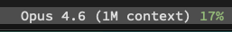
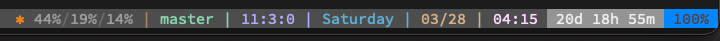
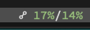
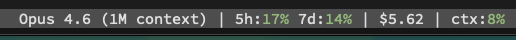
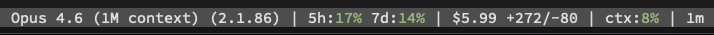

# TMUX Plugin - Claude Code Usage

Show your [Claude Code](https://claude.ai/code) rate limits, cost, and model in your tmux status bar.

:detective: MITMs Claude Code's statusline JSON, siphons off the good bits to a cache file, and lets tmux have a peek. Your existing statusline script never suspects a thing.

## Requirements

- [tmux](https://github.com/tmux/tmux)
- [TPM](https://github.com/tmux-plugins/tpm)
- [Claude Code](https://claude.ai/code)
- `jq` or `python3` (for JSON parsing)

## Installation

### 1. Install the plugin

Add to your `.tmux.conf`:

```tmux
set -g @plugin 'robhurring/tmux-claude-usage'
```

Press `prefix + I` to install.

### 2. Configure Claude Code statusline

In `~/.claude/settings.json`, wrap your existing statusline command with `claude-cache-usage`:

**If you have an existing statusline script:**

```json
{
  "statusLine": {
    "type": "command",
    "command": "$TMUX_PLUGIN_MANAGER_PATH/tmux-claude-usage/bin/claude-cache-usage your-existing-statusline-script"
  }
}
```

**If you don't have a statusline script:**

```json
{
  "statusLine": {
    "type": "command",
    "command": "$TMUX_PLUGIN_MANAGER_PATH/tmux-claude-usage/bin/claude-cache-usage"
  }
}
```

`claude-cache-usage` transparently caches the JSON and pipes it through to your command. Your existing script receives the exact same stdin — nothing changes.

### 3. Add format strings to your status bar

```tmux
set -g status-right '#{claude_model} 5h:#{claude_5h_percent}%% 7d:#{claude_7d_percent}%% | %H:%M'
```

## Format Strings

### Rate Limits

| Token | Example | Description |
|-------|---------|-------------|
| `#{claude_5h_percent}` | `24` | 5-hour rolling window usage |
| `#{claude_5h_color}` | `24` | 5-hour usage with color (green/yellow/red) |
| `#{claude_7d_percent}` | `41` | 7-day rolling window usage |
| `#{claude_7d_color}` | `41` | 7-day usage with color (green/yellow/red) |

### Cost

| Token | Example | Description |
|-------|---------|-------------|
| `#{claude_cost}` | `$1.23` | Session cost in USD |
| `#{claude_lines_added}` | `42` | Total lines added this session |
| `#{claude_lines_removed}` | `17` | Total lines removed this session |

### Context

| Token | Example | Description |
|-------|---------|-------------|
| `#{claude_context_percent}` | `63` | Context window used |
| `#{claude_context_color}` | `63` | Context usage with color (green/yellow/red) |
| `#{claude_context_remaining}` | `37` | Context window remaining |
| `#{claude_exceeds_200k}` | `200k+` | Configurable output based on 200k threshold |

### Session

| Token | Example | Description |
|-------|---------|-------------|
| `#{claude_cache_age}` | `4m` | Time since last cache update |
| `#{claude_model}` | `Opus` | Current model display name |
| `#{claude_model_id}` | `claude-opus-4-6` | Full model identifier |
| `#{claude_version}` | `1.0.0` | Claude Code version |
| `#{claude_cwd}` | `/Users/me/proj` | Current working directory |
| `#{claude_project}` | `/Users/me/proj` | Workspace project directory |

## Configuration

All options are set via tmux `set -g`:

```tmux
# Color thresholds for #{claude_*_color} tokens
set -g @claude_usage_threshold_mid "50"   # yellow above this (default: 50)
set -g @claude_usage_threshold_high "80"  # red above this (default: 80)
set -g @claude_usage_color_low "colour2"  # green (default: colour2)
set -g @claude_usage_color_mid "colour3"  # yellow (default: colour3)
set -g @claude_usage_color_high "colour1" # red (default: colour1)

# What to show when context exceeds 200k tokens (default: "200k+")
set -g @claude_usage_over_200k "⚠️ "

# What to show when context is under 200k tokens (default: empty/hidden)
set -g @claude_usage_under_200k ""
```

### Cache Location

By default the cache lives at `<plugin-dir>/claude-usage.json`. Override with `$CLAUDE_USAGE_CACHE`:

```bash
export CLAUDE_USAGE_CACHE="$HOME/claude-usage.json"
```

## Examples

### Minimal — model + 5h rate limit

```tmux
set -g status-right '#{claude_model} #{claude_5h_color}%%#[default] | %H:%M'
```



### Compact — colored rate limits with warning

```tmux
set -g @claude_usage_over_200k "⚠️ "
set -g status-right '☍ #{claude_5h_color}%%#[default]/#{claude_7d_color}%%#[default]#{claude_exceeds_200k} | %H:%M'
```

### Compact 2 - Bit more

`Context / 5h / 7d` - out of the way, enough context.

```tmux
set -g @claude_usage_color_low "colour247"
set -g @claude_usage_color_mid "colour3"
set -g @claude_usage_color_high "colour1"
set -g status-right '#[fg=colour208]✻#[default] #{claude_context_color}#{claude_context_percent}%%#[fg=colour242]/#[default]#{claude_5h_color}%%#[fg=colour242]/#[default]#{claude_7d_color}%%#[default] | ...'
```






### Detailed — model, rates, cost, and context

```tmux
set -g @claude_usage_over_200k " ⚠️"
set -g status-right '#{claude_model} | 5h:#{claude_5h_color}%%#[default] 7d:#{claude_7d_color}%%#[default] | #{claude_cost} | ctx:#{claude_context_color}%%#[default]#{claude_exceeds_200k} | %H:%M'
```



### Kitchen sink — everything

```tmux
set -g @claude_usage_over_200k " ⚠️"
set -g status-right '#{claude_model} (#{claude_version}) | 5h:#{claude_5h_color}%%#[default] 7d:#{claude_7d_color}%%#[default] | #{claude_cost} +#{claude_lines_added}/-#{claude_lines_removed} | ctx:#{claude_context_color}%%#[default]#{claude_exceeds_200k} | #{claude_cache_age} | %H:%M'
```



## How It Works

Claude Code already pipes JSON to your statusline script on every response. `claude-cache-usage` sits in the middle — it `tee`s that JSON off to a file before passing it through to your existing script. Your script never knows the difference.

On the tmux side, the plugin scripts just read that cached JSON and spit out formatted values. The cache updates every time Claude responds, so there's no polling or API calls involved.

## Rate Limits

The 5-hour and 7-day usage percentages are available for Claude Pro/Max subscribers. They reflect your rolling rate limit utilization as reported by Claude Code.

## Development

Requires [bats-core](https://github.com/bats-core/bats-core) for testing:

```bash
make test
```

## License

[MIT](LICENSE)
